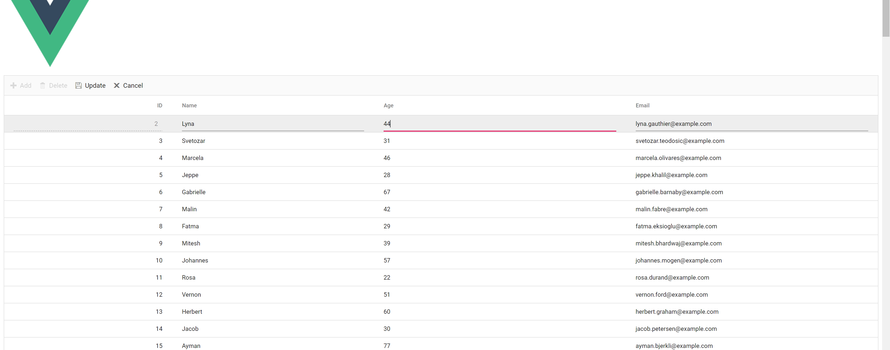
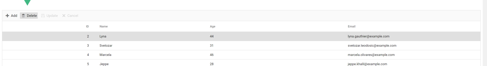

# Contact-Manegement-System

A simple CRUD project, we can create, delete and update the contacts.

## Table of Contents

- [Features](#features)
- [Installation](#installation)
- [Usage](#usage)
- [API Documentation](#api-documentation)
- [License](#license)

## Features

### Display all people

### Create new people

### Update people's details

### Delete people

## Installation
```
1.git clone https://github.com/law-cell/Contact-Manegement-System.git
2.mvn clean install
```

## Usage

1.open application.properties and change the database username and password to yours.

2.run DemoApplication.

3.open src/main/resources/static/editor.html.

## API Documentation

This API allows you to manage people records. It provides CRUD operations for managing people records.

### Base URL

`http://localhost:8080/api/v1/people`

### Endpoints

#### Get All People

Retrieves all people records.

- **URL:** `/getAllPeople`
- **Method:** GET
- **Response:** `200 OK` with a JSON array of people records.

Example Response Body:
```json
[
  {
    "id": 1,
    "name": "John Doe",
    "age": 30,
    "email": "john@gmail.com"
  },
  {
    "id": 2,
    "name": "Jane Doe",
    "age": 25,
    "email": "jane@gmail.com"
  }
]
```

#### Add New People
Adds a new people record.

- **URL:** `/addNewPeople`
- **Method:** POST
- **Request Body:** JSON object representing a people record.
Example Request Body:
```
{
  "name": "Bob Smith",
  "age": 40,
  "email": "bob@gmail.com"
}
```

#### Delete People
Deletes a people record by ID.

- **URL:** /delete/{peopleId}
- **Method:** DELETE
- **URL Parameters:** peopleId - the ID of the people record to be deleted.
- **Response:** 204 No Content indicating the people record was successfully deleted.

#### Update People
Updates an existing people record.

- **URL:** /update/{id}
- **Method:** PUT
- **URL Parameters:** id - the ID of the people record to be updated.
- **Request Body:** JSON object representing the updated people record.

Example Request Body:
```
{
  "name": "Bob Smith",
  "age": 42,
  "email": "bob@gmail.com"
}
```
- **Response:** `200 OK` with the JSON object representing the updated people record.

#### Error Responses
The following error responses may be returned by the API:

- **400 Bad Request** - The request was invalid or malformed.
- **404 Not Found** - The requested resource was not found.
- **500 Internal Server Error** - An unexpected error occurred on the server.
## License

This project is licensed under the terms of the MIT license. See the [LICENSE](LICENSE) file for details.
